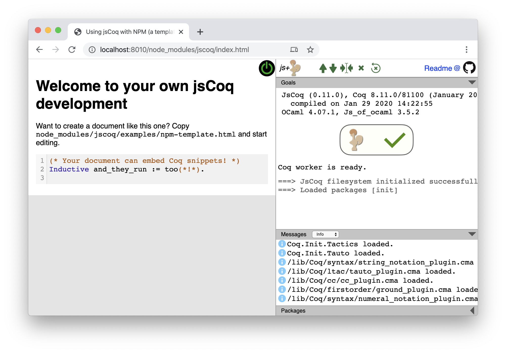

# Embedding jsCoq

This quick tutorial will allow you to embed jsCoq in your web page.
It is especially useful when you have generated your page using `coqdoc`.

## Preparation

The easiest way to obtain a distribution of jsCoq for the purpose of serving as part of your site is via `npm`.
If you already have a `package.json` file in your project, great.
Otherwise, in the root directory of your project, run `npm init`.
You will be asked to type the name of the project and a few other details, and then a `package.json` will be created.
Of course, creating a `package.json` file with any text editor is also acceptable.

Now run:
```
% npm i jscoq
```

And you have installed jsCoq in your project!
You will find it under `node_modules/jscoq`.
To test your new setup, serve your project root directory over HTTP(S), and navigate to `node_modules/jscoq/index.html`.




## Combining with your Coq development

If you're starting fresh, copying `node_modules/examples/npm-template.html` into the root directory of your project and writing your content there would be easiest.

Notice that if you want to put your HTML file(s) in a subfolder, you will have to adjust the paths (`<script src="...">`, `base_path: '...'`, and `'./node_modules'`) to the appropriate relative or absolute URL paths.

Sometimes, though, you will already have an HTML document, and want to "inject" jsCoq into it.
This is typical when using `coqdoc`:
your development is contained in a `.v` file, which `coqdoc` transforms into HTML.

The following boilerplate code can help you get started.

```js
/**
 * Injects jsCoq into an existing page.
 * This script has to be at the end of the body so that it runs after
 * the page DOM has loaded.
 */

function jsCoqInject() {
    document.body.classList.add('toggled');
    document.body.id = 'ide-wrapper';
}

var jsCoqShow = (localStorage.jsCoqShow !== 'false');

var jscoq_ids  = ['#main > div.code'];
var jscoq_opts = {
    show:      jsCoqShow,
    focus:     false,
    replace:   true,
    base_path: './node_modules/jscoq/',
    editor:    { mode: { 'company-coq': true }, keyMap: 'default' },
    all_pkgs:  ['init',
                'coq-base', 'coq-collections', 'coq-arith', 'coq-reals'],
    init_pkgs: ['init'],
    init_import: ['utf8'],
    implicit_libs: true
};

function jsCoqLoad() {
    // - remove empty code fragments (coqdoc generates some spurious ones)
    for (let sel of jscoq_ids) {
        for (let el of document.querySelectorAll(sel)) {
            if (el.textContent.match(/^\s*$/)) {
                el.parentElement.insertBefore(document.createElement('p'), el);
                el.remove();
            }
        }
    }

    JsCoq.start(jscoq_opts.base_path, './node_modules', jscoq_ids, jscoq_opts)
        .then(coq => {
            window.coq = coq;
            window.addEventListener('beforeunload', () => { localStorage.jsCoqShow = coq.layout.isVisible(); });
            document.querySelector('#page').focus();
        });
    
    if (jscoq_opts.show)
        document.body.classList.add('jscoq-launched');
}

if (location.search === '') {
    jsCoqInject();
    jsCoqLoad();
}
```

Copy it to <i>e.g.</i> `jscoq-embed.js` in your project, and then add the following two `<script>` tags at the end of your `<body>`:

```html
<script src="node_modules/jscoq/jscoq-loader.js"></script>
<script src="jscoq-embed.js"></script>
```

If you want to add those lines automatically as part as your build process, you can use [this nifty `gawk` script](./inject-jscoq.gawk).